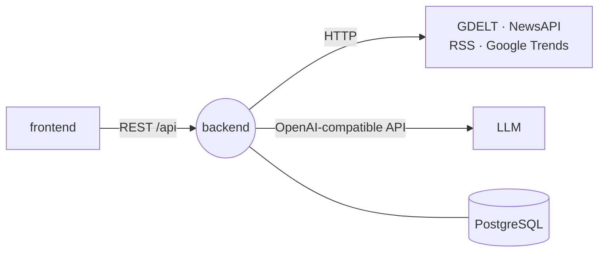
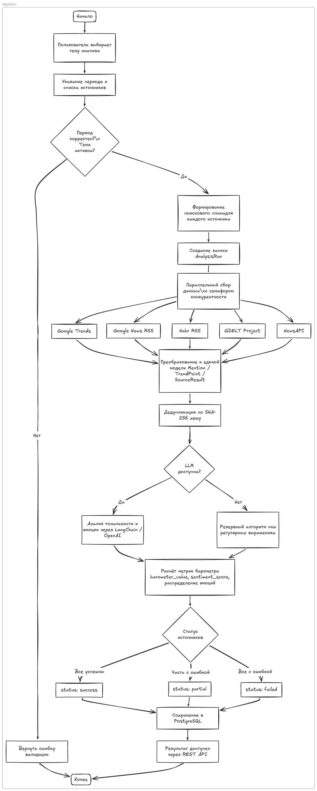

# Digital Barometer Backend

REST API that collects mentions from news and search sources and rates them with an LLM.

Stack: Python 3.12+, FastAPI, PostgreSQL, SQLAlchemy, Alembic, LangChain, uv.

## Role in the system

Given a topic and a period, the backend queries the selected sources in parallel,
cleans up and deduplicates the results, has an LLM rate each mention's sentiment and
emotion, and rolls it all into a 0–100 barometer, charts, and short insights for the
`frontend`.



## Features

- **Sources** — GDELT, NewsAPI, RSS feeds (e.g. Google News), and Google Trends via SerpApi. `ConnectorFactory` picks the connector from the source's `config`.
- **Parallel fetching** — limited by `SOURCE_FETCH_MAX_CONCURRENCY`, optionally through `OUTBOUND_PROXY_URL`. Duplicates are dropped by content hash.
- **LLM analysis** — LangChain sends mentions in batches for sentiment and emotion, then builds topic-level metrics and insights.
- **Fallback** — if the LLM is missing or fails, a keyword heuristic takes over and the run still finishes.
- **Barometer** — `(positive − negative) / total` scaled to 0–100: under 40 is negative, over 60 is positive.
- **Per-source status** — a run ends as `success`, `partial`, or `failed`.
- **No leaked secrets** — API keys and `Authorization` headers are removed from error messages before saving.

## Analysis flow

<div align="center">
<a href="docs/assets/flowchart.png"></a>
</div>

## Contracts

| Direction | Channel | Name | Payload |
| --- | --- | --- | --- |
| In | HTTP | `GET /health` | `{ status }` |
| In | HTTP | `GET /sources` | active sources |
| In | HTTP | `GET` / `POST /topics` · `PATCH /topics/{id}` | `{ name, keywords }` / `{ keywords }` |
| In | HTTP | `POST /analysis` | `{ topic_id, date_from, date_to, source_ids }` → run with mentions, trends, metrics |
| In | HTTP | `GET /analysis/{id}` · `GET /analysis/{id}/charts` | run result and chart data |
| Out | HTTP | GDELT, NewsAPI, RSS, SerpApi | `NEWSAPI_API_KEY`, `SERPAPI_API_KEY` |
| Out | HTTP | OpenAI-compatible API | `OPENAI_API_KEY`, `OPENAI_BASE_URL`, `SENTIMENT_MODEL`, `ANALYSIS_MODEL` |
| Storage | PostgreSQL | `topics`, `sources`, `analysis_runs`, `source_results`, `mentions`, `trend_points`, `analysis_metrics`, `reports` | — |

Swagger UI is at `/docs`.

## Data model

<div align="center">
<a href="docs/assets/db.png"></a>
</div>

Models and Alembic migrations live in a separate package, `digital-barometer-db`
(`src/db`). The seed (`src/db/seed/*.csv`) adds default sources and sample topics.

## Quick start

You need the `web_network` Docker network, Traefik, and PostgreSQL from
`infra`.

```bash
cp .env.example .env               # POSTGRES_*, API_PUBLIC_HOST, OPENAI_*, NEWSAPI_API_KEY, SERPAPI_API_KEY
docker compose run --rm migrate-db # migrations
docker compose run --rm seed-db    # default sources and topics
docker compose up -d --build api   # http://localhost:8000
```

Without Docker (PostgreSQL from `.env`):

```bash
uv sync
uv run alembic -c src/db/alembic.ini upgrade head
uv run uvicorn app.main:app --reload --app-dir src --port 8000
uv run python -m unittest discover -s tests
```

## Structure

```text
backend/
├── Dockerfile · Dockerfile.migrate · Dockerfile.seed
├── docs/assets/           # diagrams
├── src/
│   ├── app/
│   │   ├── api/           # routes: health, sources, topics, analysis
│   │   ├── connectors/    # gdelt, newsapi, rss, trends + ConnectorFactory
│   │   ├── core/          # settings, DI container
│   │   ├── repositories/  # topics, sources, analysis
│   │   ├── schemas/       # request/response models
│   │   └── services/      # analysis, llm, sentiment, summary, metrics, search_plan, source_fetch
│   └── db/                # models, Alembic, seed
└── tests/
```
