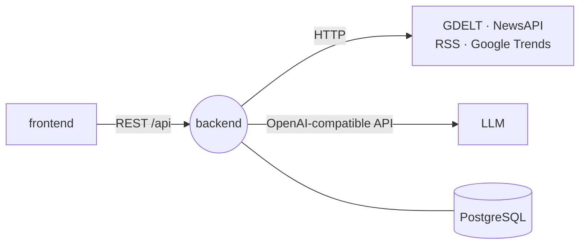

<div align="center">

<a href="https://gitlab.com/digital-barometer"></a>

# 🧠 backend

### REST API, data collection from news and search sources, LLM sentiment and emotion analysis

[](https://gitlab.com/digital-barometer/backend/-/pipelines)


<sub>Part of <a href="https://gitlab.com/digital-barometer"><b>Digital Barometer</b></a> — media monitoring with an LLM sentiment barometer</sub>

</div>

---

## Role in the system

The single backend of Digital Barometer. For a topic and a period it queries every selected source in
parallel, normalizes and deduplicates the results, rates each mention's sentiment and emotion with an
LLM, and rolls everything up into a 0–100 "barometer" index, charts and short insights for the
[frontend](https://gitlab.com/digital-barometer/frontend).



## Features

- **Pluggable sources** — `ConnectorFactory` picks a connector from the source's `config`: GDELT Doc API, NewsAPI, RSS search feeds (e.g. Google News), Google Trends via SerpApi.
- **Parallel collection** — sources are fetched concurrently under `SOURCE_FETCH_MAX_CONCURRENCY`, optionally through `OUTBOUND_PROXY_URL`; results are deduplicated by a SHA-256 content hash.
- **LLM analysis** — LangChain sends mentions in batches (`LLM_SENTIMENT_BATCH_SIZE`, `LLM_MAX_CONCURRENCY`) for sentiment and emotion, then builds topic-level metrics and insights.
- **Graceful degradation** — if the LLM is not configured or fails, a keyword heuristic takes over and the run still completes.
- **Barometer index** — `(positive − negative) / total` mapped to 0–100: below 40 negative, above 60 positive, otherwise neutral.
- **Per-source status** — each source is tracked separately; a run ends as `success`, `partial` or `failed`.
- **Secret redaction** — API keys and `Authorization` headers are stripped from source error messages before they are stored.

## Analysis flow

<div align="center">
<a href="docs/assets/flowchart.png"></a>
</div>

## Contracts

| Direction | Channel | Name | Payload |
| --- | --- | --- | --- |
| ⬅️ In | HTTP | `GET /health` | `{ status }` |
| ⬅️ In | HTTP | `GET /sources` | active sources |
| ⬅️ In | HTTP | `GET` / `POST /topics` · `PATCH /topics/{id}` | `{ name, keywords }` / `{ keywords }` |
| ⬅️ In | HTTP | `POST /analysis` | `{ topic_id, date_from, date_to, source_ids }` → run with mentions, trend points, metrics |
| ⬅️ In | HTTP | `GET /analysis/{id}` · `GET /analysis/{id}/charts` | run result, chart series (mentions by day, emotions, trends) |
| ➡️ Out | HTTP | GDELT, NewsAPI, RSS, SerpApi | `NEWSAPI_API_KEY`, `SERPAPI_API_KEY` |
| ➡️ Out | HTTP | OpenAI-compatible endpoint | `OPENAI_API_KEY`, `OPENAI_BASE_URL`, `SENTIMENT_MODEL`, `ANALYSIS_MODEL` |
| 💾 Storage | PostgreSQL | `topics`, `sources`, `analysis_runs`, `source_results`, `mentions`, `trend_points`, `analysis_metrics`, `reports` | — |

Swagger UI: `/docs`.

## Data model

<div align="center">
<a href="docs/assets/db.png"></a>
</div>

Models and Alembic migrations live in a separate package, `digital-barometer-db` (`src/db`), installed as an
editable dependency. Seed data (`src/db/seed/*.csv`) adds the default sources and sample topics.

## Quick start

Needs the external Docker network `web_network`, plus Traefik and PostgreSQL from
[infra](https://gitlab.com/digital-barometer/infra).

```bash
cp .env.example .env               # POSTGRES_*, API_PUBLIC_HOST, OPENAI_*, NEWSAPI_API_KEY, SERPAPI_API_KEY
docker compose run --rm migrate-db # alembic upgrade head
docker compose run --rm seed-db    # default sources and topics
docker compose up -d --build api   # http://localhost:8000
```

**Local development** (PostgreSQL reachable from `.env`):

```bash
uv sync
uv run alembic -c src/db/alembic.ini upgrade head
uv run uvicorn app.main:app --reload --app-dir src --port 8000
uv run python -m unittest discover -s tests
```

## Structure

```text
backend/
├── Dockerfile · Dockerfile.migrate · Dockerfile.seed
├── docs/assets/           # architecture, flowchart, ERD
├── src/
│   ├── app/
│   │   ├── api/           # routes: health, sources, topics, analysis
│   │   ├── connectors/    # gdelt, newsapi, rss, trends + ConnectorFactory
│   │   ├── core/          # settings (pydantic-settings), DI container (dishka)
│   │   ├── repositories/  # topics, sources, analysis
│   │   ├── schemas/       # request / response models
│   │   └── services/      # analysis, llm, sentiment, summary, metrics, search_plan, source_fetch
│   └── db/                # digital-barometer-db: SQLAlchemy models, Alembic, seed
└── tests/                 # unittest
```
